# BYOS Setup Guide
## How to set up your own server on DigitalOcean

This guide walks you through getting BYOS (Bring Your Own Server) running on DigitalOcean. BYOS receives your suppliers' emails and WhatsApp messages and forwards them to SABAI 365 for processing.

**Files in this folder:** [`startup.sh`](startup.sh) — fill in your keys, then paste the whole script into DigitalOcean **User Data** (see Part 3).

**Time needed:** About 15 minutes  
**Technical skill required:** None — just follow the steps  
**Ongoing maintenance:** None — BYOS updates itself automatically

---

## What you'll need before you start

- Your **SABAI API key** — ask your SABAI account manager for this
- Your **OpenAI API key** — from [platform.openai.com](https://platform.openai.com)
- A credit card (the server costs about **$12/month**)

---

## Part 1 — Prepare your startup script

Before creating the server, you need to fill in a short text file with your details. The server will read this file automatically when it first starts.

1. Open [`startup.sh`](startup.sh) in any text editor (Notepad on Windows, TextEdit on Mac).

2. Find the section near the top that says `FILL IN YOUR DETAILS HERE`. It looks like this:

   ```
   BYOS_ADMIN_PASSWORD=""
   SABAI_API_KEY=""
   OPENAI_API_KEY=""
   SECRET_ENCRYPTION_KEY=""
   ```

3. Fill in each value between the quotes:

   | Field | What to put |
   |---|---|
   | `BYOS_ADMIN_PASSWORD` | A password you'll use to log into the BYOS web interface. Make it something memorable. |
   | `SABAI_API_KEY` | Your SABAI API key from your account manager. |
   | `OPENAI_API_KEY` | Your OpenAI API key. |
   | `SECRET_ENCRYPTION_KEY` | A secret BYOS uses to encrypt supplier data. It can be any strong string (the app hashes it before encryption). Easy option: run `openssl rand -hex 32` on your computer and paste the output. **Store a copy somewhere safe** — you may need it to recover data. SABAI does not have this key. |

4. Once filled in, **select all the text** in the file and copy it (`Ctrl+A` then `Ctrl+C` on Windows, `Cmd+A` then `Cmd+C` on Mac). Keep it copied — you'll paste it shortly.

---

## Part 2 — Create a DigitalOcean account

1. Go to [digitalocean.com](https://digitalocean.com) and click **Sign Up**.

   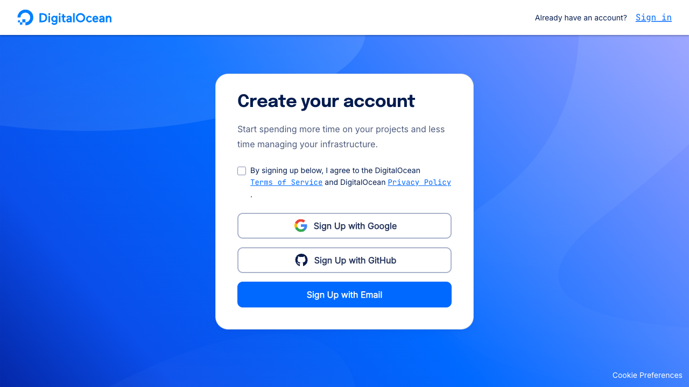

2. Click **Sign Up with Email**, tick the Terms of Service box, then fill in your name, email, and a password.

   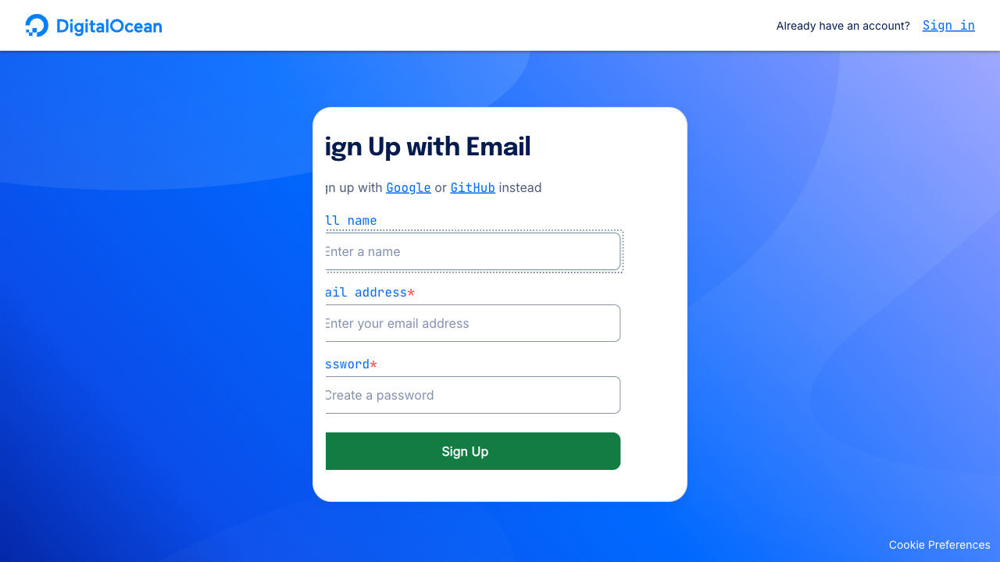

3. Click **Sign Up**.

4. Check your inbox for a verification email from DigitalOcean and click the confirmation link.

5. Complete the short onboarding questionnaire (just click through it) — you'll end up on the main dashboard.

   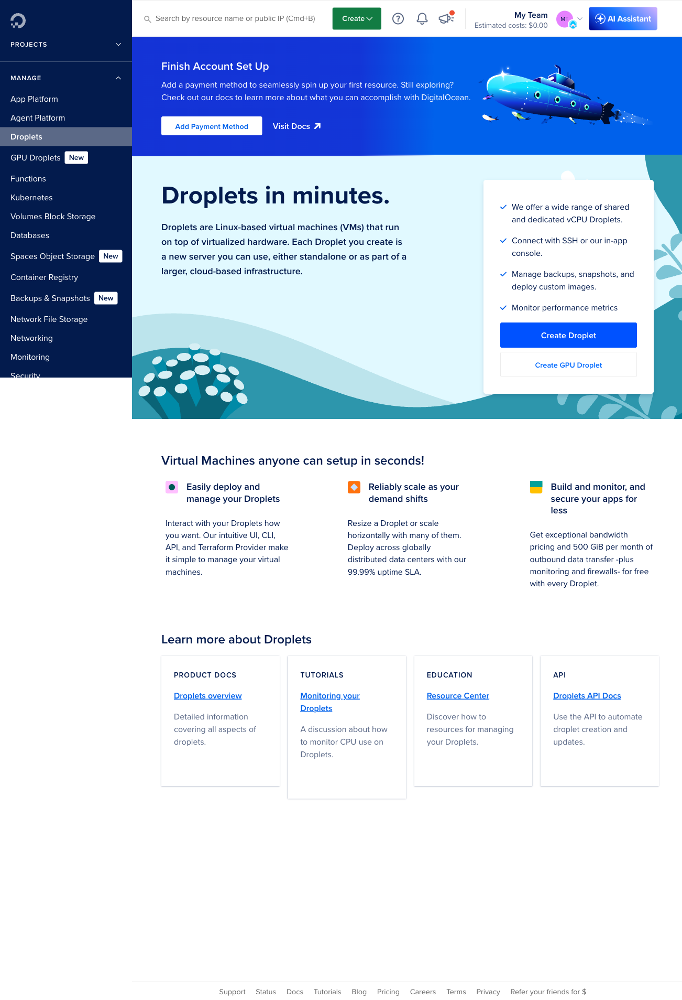

   > You will need to add a payment method before you can create a server. DigitalOcean will prompt you when you try to create a Droplet in the next step. The server costs about **$12/month**.

---

## Part 3 — Create your server

In DigitalOcean, a server is called a **Droplet**.

1. From the dashboard, click the green **Create** button at the top and select **Droplets**.

   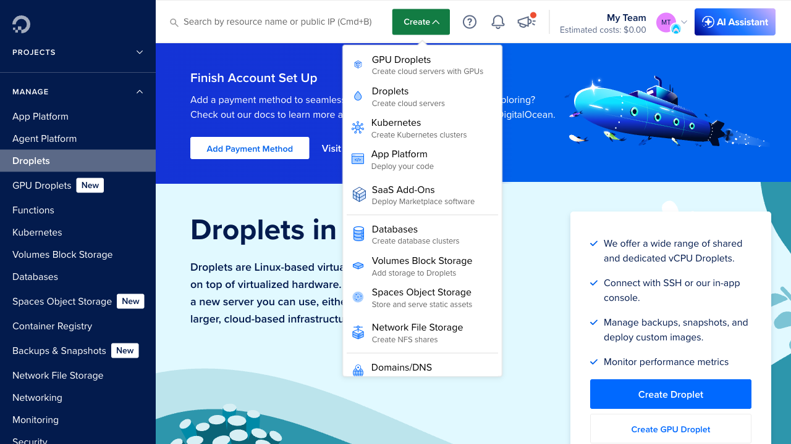

2. You'll see the Droplet creation page.

   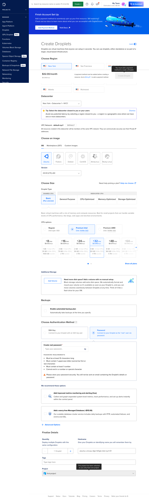

3. **Region:** Choose the location closest to you or that you prefer for regulatory reasons (e.g. GDPR)

   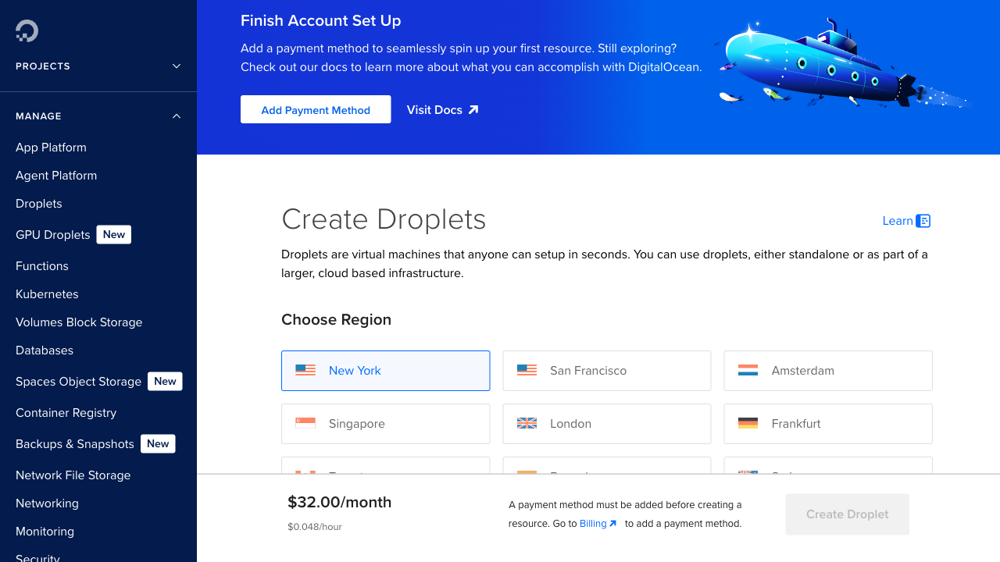

4. **Image:** Make sure **Ubuntu** is selected (it usually is by default).

   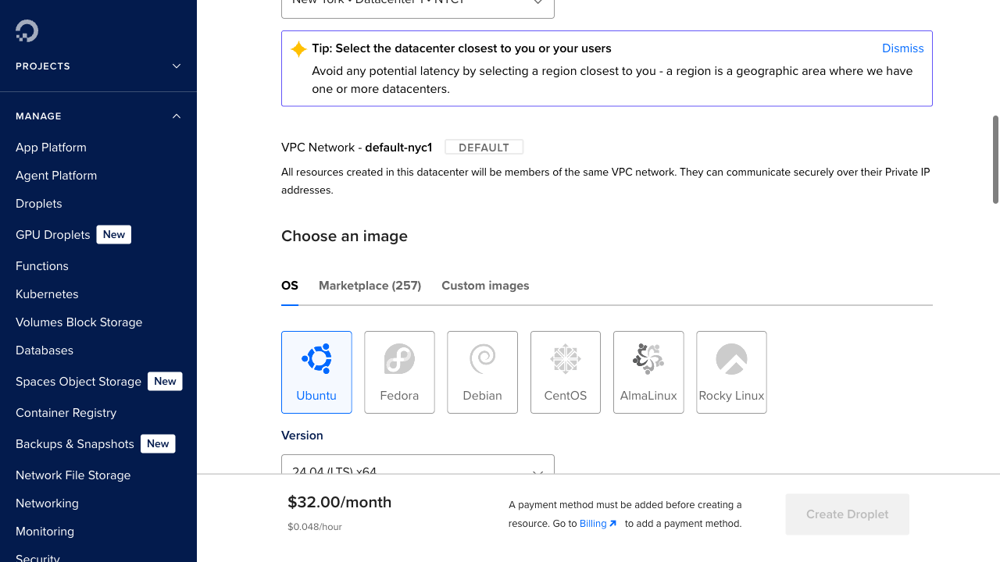

5. **Plan:** Click **Basic**, then click **Regular** under "CPU options" (it may default to Premium Intel — make sure you switch to Regular). Then select the **$12/month** tile (2 GB / 1 CPU / 50 GB SSD). It should highlight in blue.

   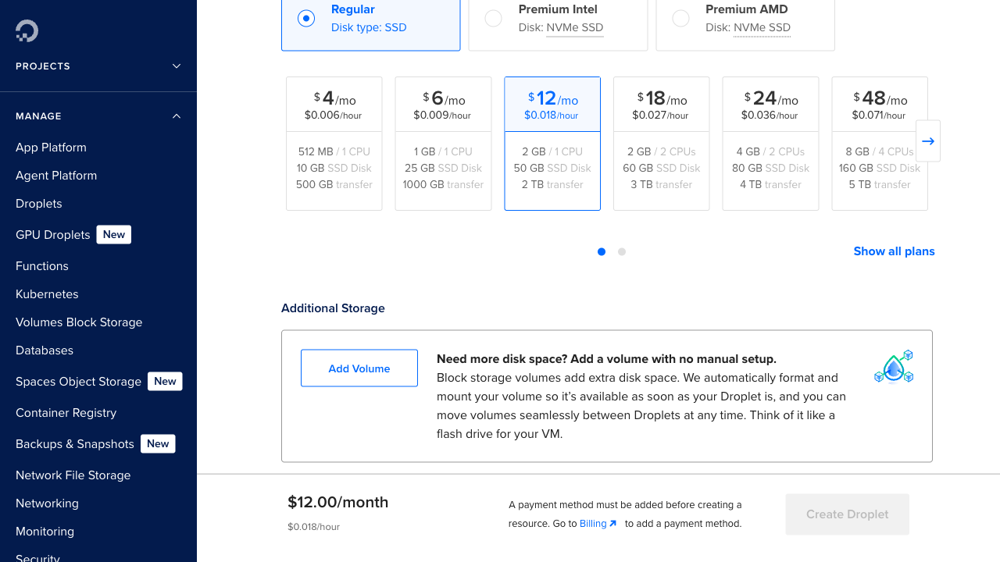

6. **Authentication:** Scroll down to **Choose Authentication Method**. Select **Password** and type a root password. Write it down — you'll need it if you ever need to access the server directly.

   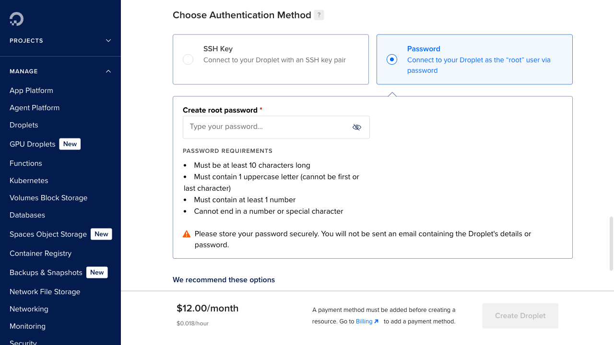

7. **Startup script (important):** Scroll down and click **Advanced Options**, then check the box next to **Add initialization scripts (free)**. A text box will appear.

   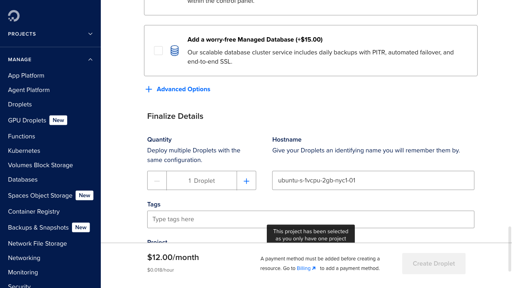

   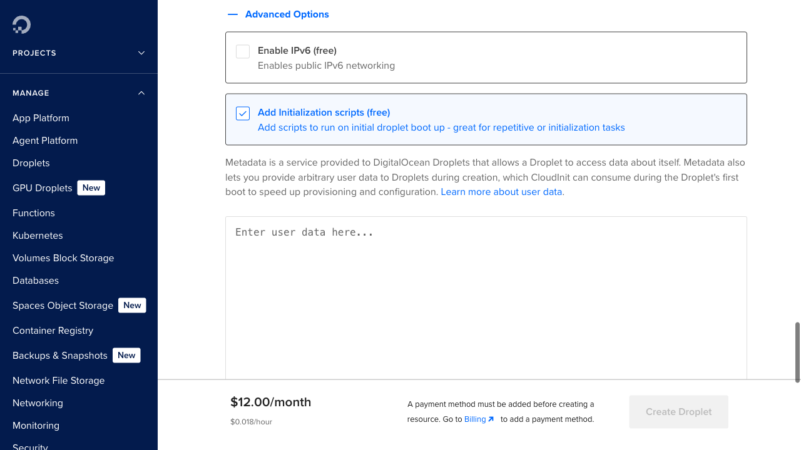

   Paste your filled-in startup script into the text box (`Ctrl+V` or `Cmd+V`).

   > This is the script you copied at the end of Part 1. It tells the server to install everything automatically when it first starts up.

8. Give your Droplet a name in the **Hostname** box, like `byos-server`.

9. Click the green **Create Droplet** button.

   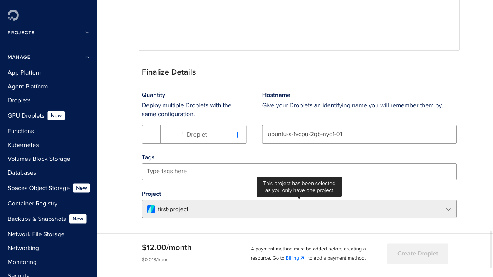

10. Wait about **2–3 minutes**. The server is starting up and installing BYOS automatically in the background. You'll see your Droplet appear in the list with an **IP address** next to it.

---

## Part 4 — Reserve a permanent IP address

By default your server's IP address could change if you ever need to rebuild it — which would break your email setup. A **Reserved IP** locks in a permanent address for free (DigitalOcean doesn't charge for Reserved IPs as long as they're attached to a running server).

1. In the left sidebar, click **Networking**, then click **Reserved IPs**.

   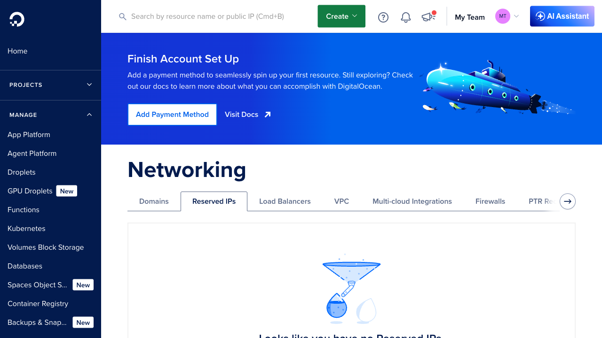

2. Click **Add a Reserved IP**. A panel will appear.

   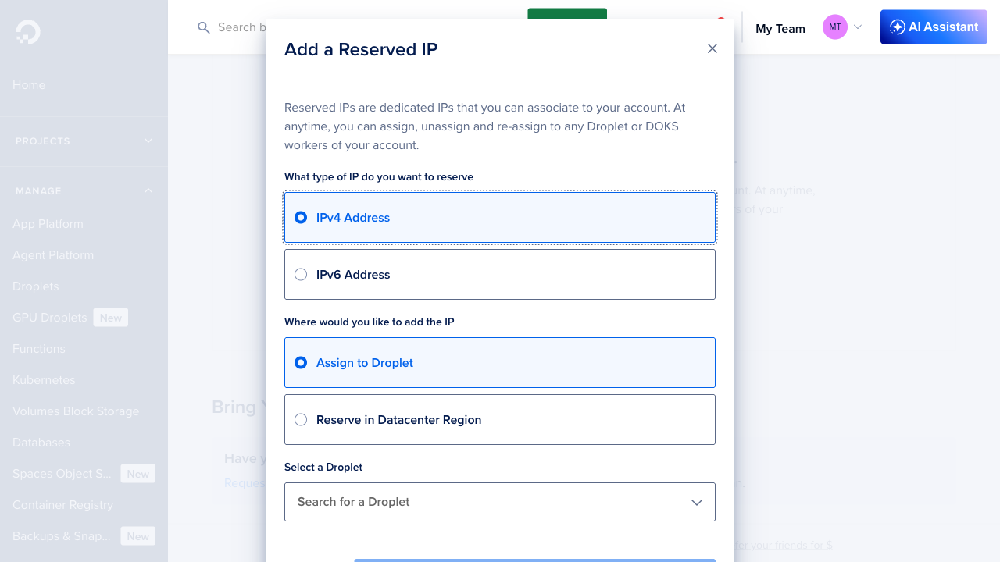

3. Leave **IPv4 Address** selected (the default). Under **Where would you like to Assign this IP?**, choose **Assign to Droplet**, then select your `byos-server` from the dropdown.

4. Click **Reserve IP**. A new IP address will be assigned within a few seconds. **Write this IP down** — use it everywhere from now on (web interface, email, etc.) instead of the original IP.

---

## Part 5 — Access the web interface

Once the server has had 2–3 minutes to finish starting up:

1. Open a web browser and go to:
   ```
   http://YOUR_RESERVED_IP
   ```
   Replace `YOUR_RESERVED_IP` with the Reserved IP address from Part 4.

2. Log in with the `BYOS_ADMIN_PASSWORD` you set in your startup script.

You're in. The web interface lets you manage suppliers, check WhatsApp status, and monitor incoming messages.

---

## Part 6 — Link WhatsApp

For BYOS to receive WhatsApp messages, you need to link it to a WhatsApp account.

1. In the BYOS web interface, find the **WhatsApp Linking** panel.
2. A QR code will appear. If not, click **Force New QR** to generate one.
3. On your phone, open WhatsApp → **Settings → Linked Devices → Link a Device**.
4. Scan the QR code shown in the web interface with your phone's camera.

Once linked, you'll see a confirmation in the web interface. Your WhatsApp session is saved permanently — you won't need to scan again unless WhatsApp logs you out.

---

## Part 7 — Set up inbound email

For BYOS to receive supplier offer emails, SABAI will configure a subdomain (e.g., `yourcompany.sabai.group`) to route email to your server. You need to send your **Reserved IP address** from Part 4 to your SABAI account manager so they can set up the MX record.

Once configured, your suppliers will send offer emails to an address at your subdomain (e.g., `offers@yourcompany.sabai.group`), and BYOS will receive and process them automatically.

> **Action required:** Send your Reserved IP address to your SABAI account manager. They will configure the email routing for you and confirm when it's ready. Your server listens for inbound email on port `2525`.

---

## Automatic updates

BYOS updates itself automatically. Whenever SABAI publishes an updated version, your server will detect it within an hour and restart with the new version — no action needed on your part.

---

## Troubleshooting

**Can't reach the web interface (`http://YOUR_IP`)**

The server may still be setting itself up. Wait a few more minutes and try again. If it still doesn't work after 5 minutes:

1. Go to your DigitalOcean dashboard and click on your Droplet.
2. Click **Console** to open a browser-based terminal.
3. Log in as `root` with the password you set.
4. Run this to check the startup log:
   ```
   cat /var/log/byos-startup.log
   ```
5. Run this to check if BYOS is running:
   ```
   cd /opt/byos && docker compose ps
   ```

**WhatsApp keeps disconnecting**

Check the web interface for the current status. If it says a new QR code is needed, just scan it again. This can happen if WhatsApp logs out the session (rare, but normal).

**Something else is wrong**

Contact your SABAI account manager with the output of:
```
cat /var/log/byos-startup.log
```
(Access this via the Console button on your Droplet page.)

---

## Part 8 — Enable HTTPS (optional)

Once your SABAI account manager has set up a subdomain for you (e.g. `yourcompany.byos.sabai.group`), you can enable HTTPS. This requires a one-time change on the server.

1. Go to your DigitalOcean dashboard and click on your Droplet.
2. Click **Console** to open a browser-based terminal.
3. Log in as `root` with the password you set.
4. Run these commands:

   ```
   cd /opt/byos
   cat > Caddyfile <<'EOF'
   yourcompany.byos.sabai.group {
       reverse_proxy byos:8787
   }
   EOF
   docker compose restart caddy
   ```

   Replace `yourcompany.byos.sabai.group` with the actual subdomain your account manager gave you.

5. Wait about 30 seconds. The server will automatically obtain an SSL certificate.

6. Open your browser and go to `https://yourcompany.byos.sabai.group` — you should see the login page with a padlock icon.

---

## Summary

| What | Value |
|---|---|
| Web interface | `http://YOUR_RESERVED_IP` (or `https://YOUR_DOMAIN` after Part 8) |
| Email (SMTP) port | `YOUR_RESERVED_IP:2525` |
| Updates | Automatic (hourly check) |
| Config file | `/opt/byos/.env` on the server |
| Startup log | `/var/log/byos-startup.log` |

---

*Need help? Contact your SABAI account manager.*
